# Nomad-Bot: AI Prospecting Assistant (V3.5)

Nomad-Bot is a modular, multi-tier agentic system designed to automate B2B operational lead generation and sales prospecting. It combines parallel lead discovery search providers with an intelligent LLM router, automated contact scrapers, and outreach prospecting CRM workflows.

---

## 🛠️ Architecture & Tech Stack

*   **Backend**: Python 3.14+, Django 6.x (REST APIs & WebSocket Consumers), Django Channels.
*   **Frontend**: React 18, TypeScript, Vite, Vanilla HSL design system.
*   **Database & Memory**: PostgreSQL/Supabase (Data persistence), Redis (Channel layers for WebSockets).
*   **LLM Providers & Router**: Google Gemini 2.5 (Primary), Groq, Cerebras, OpenRouter, and Ollama. Incorporates a dynamic waterfall router for error-resilient fallbacks.
*   **Web Crawling**: BeautifulSoup4, public OpenStreetMap Nominatim APIs, and DuckDuckGo HTML parsers.

---

## ✨ Core Features

1.  **Lead Discovery CRM & Prospecting**:
    *   **5-Way Parallel Aggregation**: Runs concurrent DuckDuckGo queries (Direct, Contact-focused, Directory listings, Reddit Intent, and GitHub organization scans).
    *   **Prioritized Contact Scraper**: Crawls up to 8 subpages, prioritizing links with contact keywords to extract emails and LinkedIn company URLs.
    *   **Intelligent Scoring**: Assesses suitability (1-10) using LLM qualification prompts.
2.  **Telemetry & Observability**: Complete timing, cost, and input/output tracing of all LLM router requests in a secondary SQLite database.
3.  **Dynamic Prompt Registry**: DB-versioned and Jinja2-compiled prompts for stable, editable LLM configurations.

### Discovery execution traces

Every prospecting discovery writes two correlated files under `discovery_traces/`:

- `<run-id>.html` — a self-contained, searchable five-stage flow viewer.
- `<run-id>.json` — the raw machine-readable trace for automated quality checks.

The viewer distinguishes LLM decisions from deterministic workflow decisions and
shows input interpretation, exact tool queries and results, scraped website text,
LLM qualification prompts/responses, timing, failures, and transparent quality
checks. Open it through the run's `trace_url`, or directly at:

```text
GET /api/v3/prospecting/discovery-runs/<run-id>/trace/
GET /api/v3/prospecting/discovery-runs/<run-id>/trace/?raw=true
```

---

## 🚀 Getting Started

### 📋 Prerequisites

Ensure you have the following installed:
*   [Python 3.10+](https://www.python.org/downloads/) (Python 3.14 recommended)
*   [Node.js (v18+)](https://nodejs.org/) and `npm`
*   [Docker](https://www.docker.com/) (for running PostgreSQL and Redis)

---

### ⚙️ Installation & Setup

#### 1. Clone the Repository
```bash
git clone https://github.com/Ingenuity07/nomad-bot.git
cd nomad-bot
```

#### 2. Configure Environment Variables
Copy the template configuration file to `.env`:
```bash
cp env.example .env
```
Open `.env` and fill in your details:
*   Add your **Gemini API Key** (Primary LLM).
*   Add optional API keys for fallback providers (Groq, Cerebras, OpenRouter).
*   Modify the PostgreSQL database password or port if necessary.

#### 3. Spin up Infrastructure (Database & Redis)
Run the Docker Compose file to start PostgreSQL (port `5433`) and Redis:
```bash
docker-compose up -d
```

#### 4. Configure Virtual Environment & Python Dependencies
```bash
python -m venv venv
source venv/bin/activate  # On Windows: venv\Scripts\activate
pip install -r requirements.txt
```

#### 5. Apply Database Migrations
```bash
python manage.py migrate
```

#### 6. Setup React Frontend
Open a new terminal window:
```bash
cd frontend
npm install
```

---

## 🏃 Running the Applications

### Start the Django Backend Server
With your virtual environment active in the root folder, run:
```bash
python manage.py runserver 8000
```
*Backend API will run at `http://localhost:8000`*

### Start the Vite Frontend Server
Inside the `frontend/` directory, run:
```bash
npm run dev
```
*Frontend interface will run at `http://localhost:5173` (or `http://localhost:5174` depending on port availability)*

---

## 🧪 Running Tests

Validate that the setup is fully correct by executing the test suite:
```bash
python manage.py test prospecting llm knowledge_base
```

# 🧠 Nomad Bot — Complete Architecture Documentation

> **Version:** V3.5 | **Stack:** Django 6 · LangGraph · Celery · Redis · Supabase (PostgreSQL) · SQLite (Telemetry) · Django Channels (WebSocket)

---

## Table of Contents

1. [System Overview](#1-system-overview)
2. [High-Level Architecture](#2-high-level-architecture)
3. [Tech Stack & Infrastructure](#3-tech-stack--infrastructure)
4. [Module Map](#4-module-map)
5. [LLM App — Deep Dive](#5-llm-app--deep-dive)
6. [Prospecting App — Deep Dive](#6-prospecting-app--deep-dive)
7. [Knowledge Base App](#7-knowledge-base-app)
8. [URL Flow Reference](#8-url-flow-reference)
9. [Data Flow Diagrams](#9-data-flow-diagrams)
10. [Database Schema Overview](#10-database-schema-overview)

---

## 1. System Overview

**Nomad Bot** is an AI-powered B2B sales prospecting platform. It operates as a multi-agent Django application with the following core value proposition:

| Mode | What it does |
|------|--------------|
| **Prospecting Engine** | Discovers B2B leads, enriches company data, qualifies prospects, and orchestrates outreach campaigns |

The engine is built on a common **LLM layer** that provides intelligent routing, observability, cost tracking, and a prompt registry.

---

## 2. High-Level Architecture

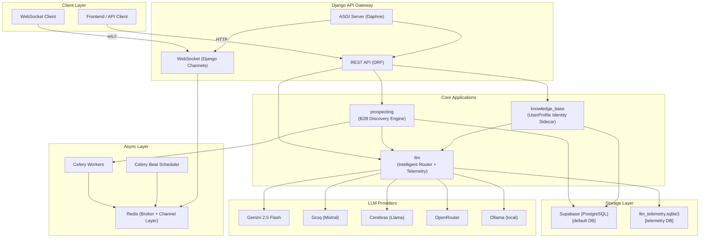

---

## 3. Tech Stack & Infrastructure

| Component | Technology |
|-----------|-----------|
| **Web Framework** | Django 6 + Django REST Framework |
| **ASGI Server** | Daphne (for WebSocket support) |
| **Agent Orchestration** | LangGraph (StateGraph Pregel) |
| **Task Queue** | Celery + Redis broker |
| **WebSocket** | Django Channels + channels-redis |
| **Primary Database** | Supabase (PostgreSQL) |
| **Telemetry Database** | SQLite (`llm_telemetry.sqlite3`) |
| **LLM Router** | Custom `IntelligentRouter` |
| **Tracing** | OpenTelemetry (OTLP exporter, optional) |
| **Schema Docs** | drf-spectacular (OpenAPI 3) |
| **Containerization** | Docker + docker-compose |

---

## 4. Module Map

```
nomad-bot/
├── config/           ← Django project settings, URLs, ASGI/WSGI
├── llm/              ← LLM router, providers, telemetry, prompt registry
├── prospecting/      ← B2B lead discovery, enrichment, outreach pipeline
├── knowledge_base/   ← User Profile models
└── docs/             ← Architecture & planning documents
```

---

## 5. LLM App — Deep Dive

The `llm` application is the **central nervous system** of Nomad Bot. Every call to any LLM provider goes through this layer, which provides routing, fallback, health monitoring, cost tracking, and full observability.

### 5.1 Component Architecture

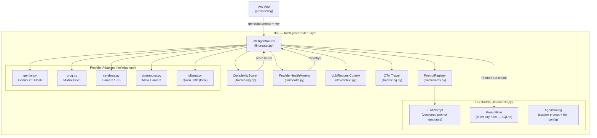

### 5.2 IntelligentRouter — Request Lifecycle

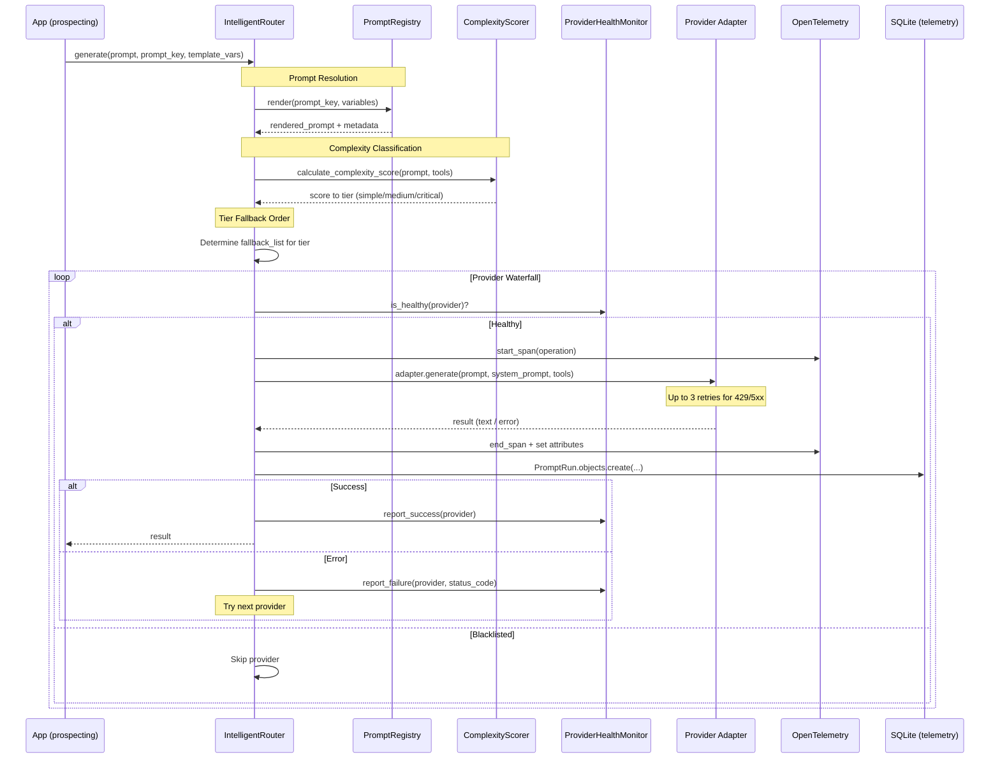

### 5.3 Complexity Scoring

The router classifies every request into a **tier** before selecting providers:

| Tier | Score Range | Priority Providers |
|------|------------|-------------------|
| `simple` | 0–5 | Groq → Ollama → Cerebras → OpenRouter → Gemini |
| `medium` | 6–12 | Groq → OpenRouter → Gemini → Ollama → Cerebras |
| `critical` | 13+ | Gemini → Groq → OpenRouter → Cerebras → Ollama |

**Scoring factors:**
- Prompt length: +3 (>1K chars), +6 (>3K), +10 (>5K)
- Keyword: `browser/scrape` = +2
- Structure: `reflect/critic` = +4, `plan/roadmap/steps` = +6
- Tools: `BrowserTool` = +3, >3 tools = +2

### 5.4 Provider Health Monitor

`ProviderHealthMonitor` is a **singleton** that tracks provider availability with cooldown blacklisting:

```
report_failure(provider, status_code)  →  blacklist for 120 seconds
report_success(provider)               →  mark healthy
is_healthy(provider)                   →  check if cooldown expired
```

### 5.5 Prompt Registry & Versioning

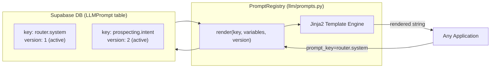

**Rules:**
- Only one version of a `key` can be `is_active=True` at a time
- Templates are **immutable** once used in a `PromptRun` (prevents history corruption)
- Templates use **Jinja2** syntax for variable injection (`{{ variable }}`)

### 5.6 Telemetry & Observability

Every LLM call persists a `PromptRun` record in the **separate SQLite telemetry database**:

| Field | Purpose |
|-------|---------|
| `provider` / `model` | Which provider was used |
| `input_tokens` / `output_tokens` | Token usage |
| `input_cost` / `output_cost` / `total_cost` | Cost in USD |
| `latency_ms` / `duration_ms` | Performance metrics |
| `trace_id` / `span_id` | OpenTelemetry trace correlation |
| `correlation_id` / `operation` | Business context |
| `prompt_key` / `prompt_version` | Prompt registry tracking |
| `status` / `error_type` / `error_code` | Error classification |
| `retry_count` | How many retries were needed |

**Analytics API:** `GET /api/llm/analytics/` returns aggregated telemetry from the SQLite database.

### 5.7 LLM API Endpoints

| Method | URL | Description |
|--------|-----|-------------|
| `GET` | `/api/llm/providers/` | List all providers with health status and models |
| `GET` | `/api/llm/analytics/` | Aggregated LLM usage, cost, and latency analytics |

---

## 6. Prospecting App — Deep Dive

The `prospecting` application is the **B2B lead generation engine**. It converts a natural language objective into a full lead discovery → qualification → enrichment → outreach pipeline.

### 6.1 End-to-End Pipeline

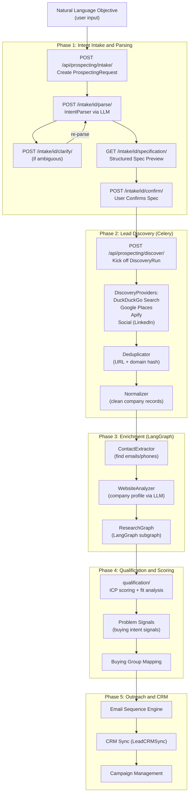

### 6.2 Intent Parsing System

The intake system converts free-form natural language into a structured `ProspectingSpecification`:

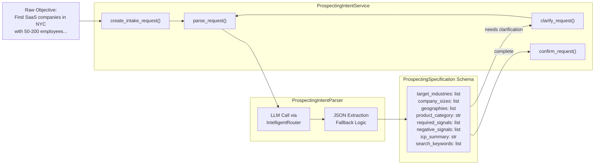

**Request Status Machine:**
```
DRAFT → PARSING → READY_FOR_REVIEW → ACTIVE
              ↓
           FAILED
```

### 6.3 Discovery Engine

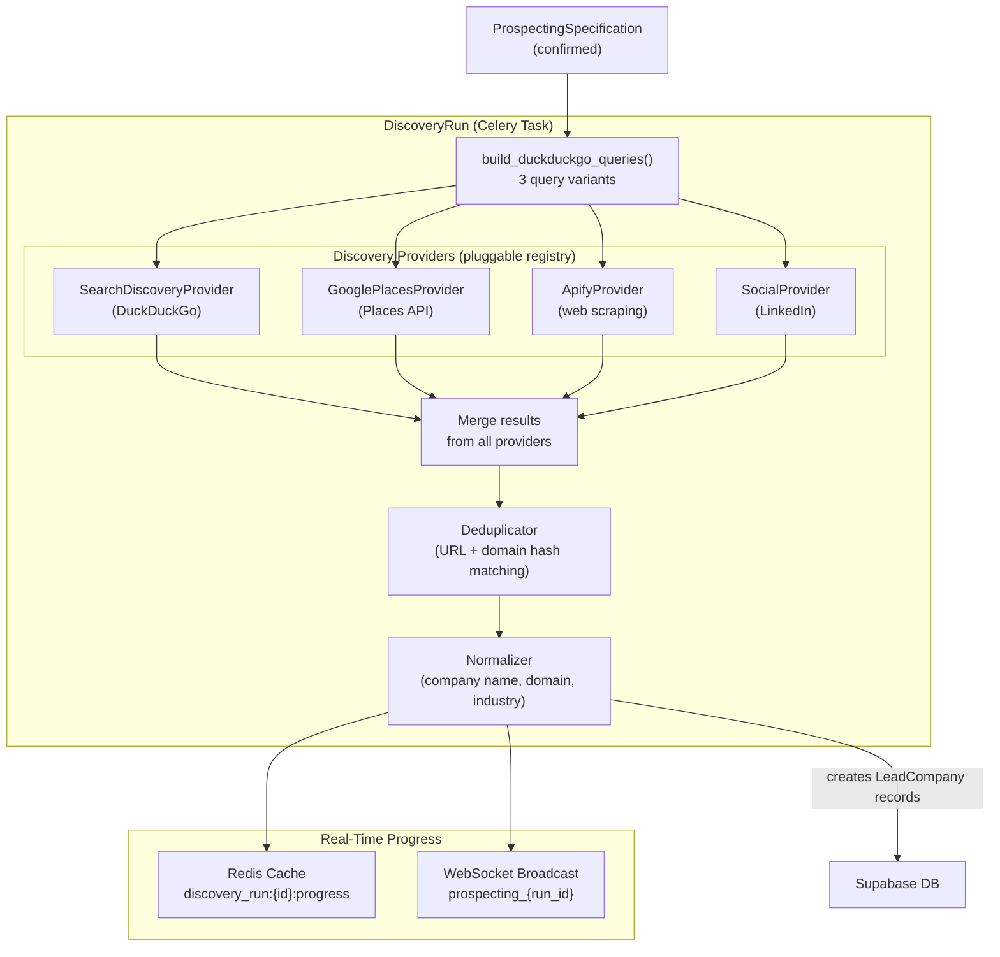

### 6.4 Lead Enrichment via LangGraph Research Graph

After discovery, each lead company undergoes deep enrichment through a dedicated **LangGraph subgraph**:

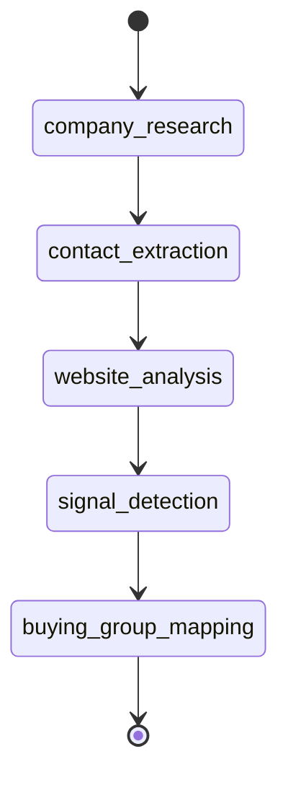

| Node | Purpose |
|------|---------|
| `company_research` | Web search + scraping for company info |
| `contact_extraction` | Find decision-maker emails and phone numbers |
| `website_analysis` | LLM-powered analysis of company website |
| `signal_detection` | Identify buying intent signals |
| `buying_group_mapping` | Map stakeholders for multi-threaded outreach |

### 6.5 Prospecting Data Model

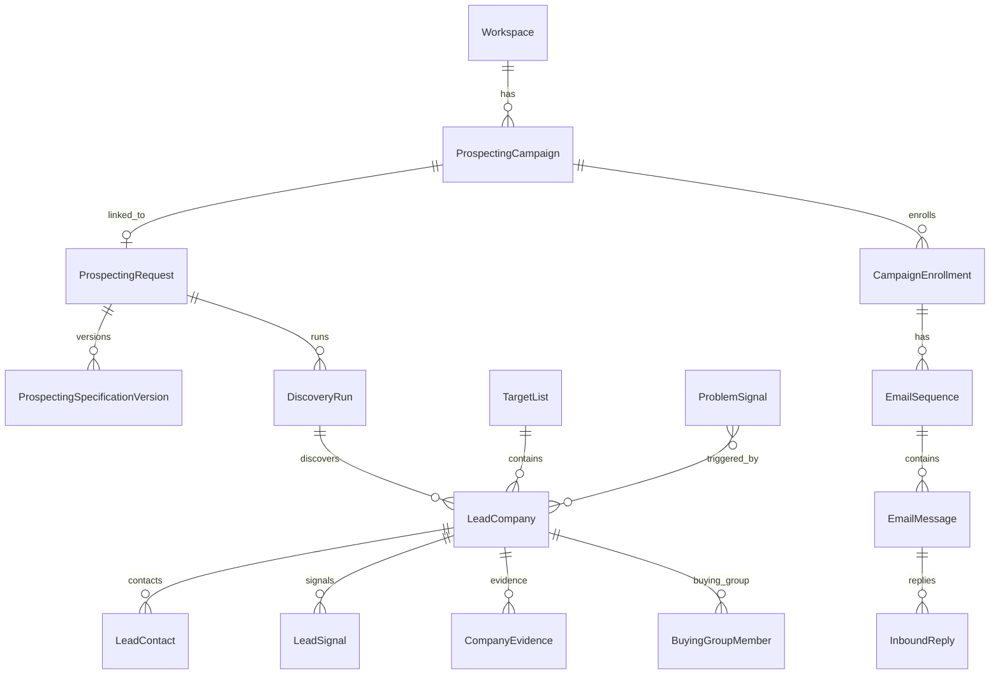

### 6.6 Prospecting API Endpoints (Full Reference)

**Intake (Natural Language → Specification)**

| Method | URL | Purpose |
|--------|-----|---------|
| `POST` | `/api/prospecting/intake/` | Create new prospecting request from NL objective |
| `GET/DELETE` | `/api/prospecting/intake/{id}/` | View or cancel intake request |
| `POST` | `/api/prospecting/intake/{id}/parse/` | Parse objective via LLM → structured spec |
| `POST` | `/api/prospecting/intake/{id}/clarify/` | Submit clarifications and re-parse |
| `GET` | `/api/prospecting/intake/{id}/specification/` | Preview generated specification |
| `POST` | `/api/prospecting/intake/{id}/confirm/` | Approve spec and activate campaign |
| `POST` | `/api/prospecting/intake/{id}/cancel/` | Cancel and discard intake |

**Discovery**

| Method | URL | Purpose |
|--------|-----|---------|
| `POST` | `/api/prospecting/discover/` | Kick off a discovery run (Celery async) |
| `GET` | `/api/prospecting/discover/{id}/status/` | Poll discovery run status/progress |
| `GET` | `/api/prospecting/discovery-runs/` | List all discovery runs |
| `GET` | `/api/prospecting/discovery-runs/{id}/` | Discovery run detail + metrics |
| `GET` | `/api/prospecting/discovery-runs/{id}/leads/` | Leads found in a specific run |

**Lead Management**

| Method | URL | Purpose |
|--------|-----|---------|
| `GET` | `/api/prospecting/leads/` | List all leads (with filters) |
| `GET/PATCH` | `/api/prospecting/leads/{id}/` | Lead detail + update status |
| `GET` | `/api/prospecting/leads/{id}/evidence/` | Company evidence (web scrapes) |
| `GET` | `/api/prospecting/leads/{id}/signals/` | Buying intent signals |
| `GET` | `/api/prospecting/leads/{id}/contacts/` | Decision-maker contacts |
| `GET` | `/api/prospecting/leads/{id}/buying-group/` | Buying group members |
| `POST` | `/api/prospecting/leads/{id}/research/` | Trigger deep research (LangGraph) |
| `POST` | `/api/prospecting/leads/{id}/refresh/` | Refresh lead data |
| `GET` | `/api/prospecting/leads/{id}/intelligence/` | AI-generated company intelligence |
| `GET` | `/api/prospecting/leads/{id}/sales-guidance/` | Sales approach recommendations |
| `POST` | `/api/prospecting/leads/{id}/feedback/` | Mark lead as good/bad fit |
| `POST` | `/api/prospecting/leads/{id}/sync-crm/` | Push to external CRM |

**Campaigns & Outreach**

| Method | URL | Purpose |
|--------|-----|---------|
| `GET/POST` | `/api/prospecting/campaigns/` | List/create campaigns |
| `GET/PATCH/DELETE` | `/api/prospecting/campaigns/{id}/` | Campaign detail |
| `GET` | `/api/prospecting/campaigns/{id}/leads/` | Leads in campaign |
| `POST` | `/api/prospecting/campaigns/enrollments/` | Enroll leads in campaign |
| `GET/POST` | `/api/prospecting/emails/sequences/` | Email sequences |
| `GET/POST` | `/api/prospecting/emails/messages/` | Email messages |
| `POST` | `/api/prospecting/emails/messages/{id}/send/` | Send email message |
| `GET/POST` | `/api/prospecting/emails/replies/` | Inbound reply tracking |

**Target Lists & Signals**

| Method | URL | Purpose |
|--------|-----|---------|
| `GET/POST` | `/api/prospecting/lists/` | Target list management |
| `GET/PATCH/DELETE` | `/api/prospecting/lists/{id}/` | Target list detail |
| `GET/POST` | `/api/prospecting/signals/` | Problem signals |
| `GET/PATCH/DELETE` | `/api/prospecting/signals/{id}/` | Signal detail |

**Dashboard**

| Method | URL | Purpose |
|--------|-----|---------|
| `GET` | `/api/prospecting/dashboard/overview/` | Pipeline overview metrics |
| `GET` | `/api/prospecting/dashboard/signals/` | Signal analytics |
| `GET` | `/api/prospecting/dashboard/funnel/` | Funnel conversion metrics |
| `GET` | `/api/prospecting/dashboard/opportunities/` | Hot opportunity list |

---

## 7. Knowledge Base App

The `knowledge_base` module operates as a minimal user identity sidecar.

### 7.1 Architecture

```
knowledge_base/
├── models.py          ← UserProfile definition
└── migrations/
```

### 7.2 Core Models

| Model | Description |
|-------|-------------|
| `UserProfile` | Central user identity record, foreign-keyed by prospecting objects. |

---

## 8. URL Flow Reference

### Global URL Configuration

```
/api/llm/          →  llm/urls.py
/api/prospecting/  →  prospecting/urls.py
/admin/            →  Django Admin
/api/schema/       →  OpenAPI 3 schema (drf-spectacular)
/api/docs/         →  Swagger UI
```

---

## 9. Data Flow Diagrams

### 9.1 Prospecting Intent to Discovery Flow

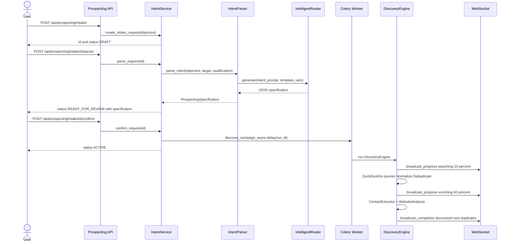

### 9.2 LLM Provider Waterfall (Failure Scenario)

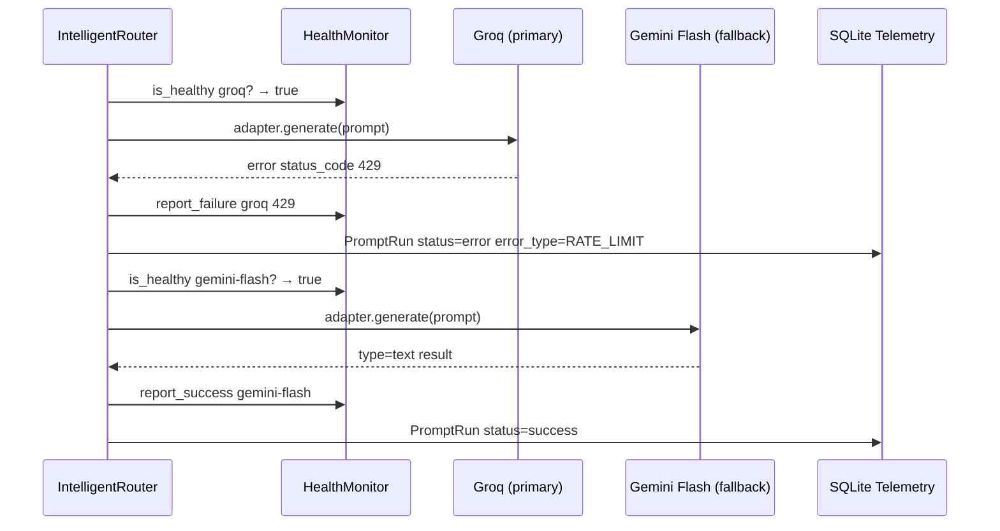

---

## 10. Database Schema Overview

### 10.1 Primary Database (Supabase / PostgreSQL)

**`llm` app tables:**
- `llm_llmprompt` — versioned prompt templates
- `llm_agentconfig` — agent system prompts and tier configuration

**`prospecting` app tables:**
- `prospecting_workspace` — multi-tenant workspace
- `prospecting_prospectingcampaign` — campaign lifecycle
- `prospecting_icpprofile` — ideal customer profile
- `prospecting_prospectingrequest` — NL intake request
- `prospecting_prospectingspecificationversion` — immutable parsed specs
- `prospecting_discoveryrun` — discovery run records
- `prospecting_leadcompany` — discovered companies
- `prospecting_leadcontact` — decision-maker contacts
- `prospecting_leadsignal` — buying intent signals
- `prospecting_companyevidence` — web scrape evidence
- `prospecting_buyinggroupmember` — stakeholder mapping
- `prospecting_targetlist` — curated lead lists
- `prospecting_campaignenrollment` — campaign to lead join
- `prospecting_emailsequence` — outreach email sequences
- `prospecting_emailmessage` — individual emails
- `prospecting_inboundreply` — reply tracking

**`knowledge_base` app tables:**
- `knowledge_base_userprofile` — user identity

### 10.2 Telemetry Database (SQLite — `llm_telemetry.sqlite3`)

> Isolated from primary DB. Uses WAL mode for concurrent read-write access.

- `llm_promptrun` — every LLM call with full observability metadata

---

## Appendix: Environment Configuration

| Variable | Purpose | Default |
|----------|---------|---------|
| `GEMINI_API_KEY` | Gemini provider key | — |
| `GROQ_API_KEY` | Groq provider key | — |
| `CEREBRAS_API_KEY` | Cerebras provider key | — |
| `OPENROUTER_API_KEY` | OpenRouter key | — |
| `GEMINI_MODEL` | Gemini model override | `gemini-2.5-flash` |
| `GROQ_MODEL` | Groq model override | `mixtral-8x7b-32768` |
| `CEREBRAS_MODEL` | Cerebras model override | `llama3.1-8b` |
| `OPENROUTER_MODEL` | OpenRouter model override | `meta-llama/llama-3-8b-instruct:free` |
| `OLLAMA_MODEL` | Ollama local model | `qwen3:8b` |
| `ROUTER_PROVIDER_PRIORITY` | Global provider order | — |
| `ROUTER_FALLBACK_SIMPLE` | Simple tier order | `groq,ollama,cerebras,openrouter,gemini-flash` |
| `ROUTER_FALLBACK_MEDIUM` | Medium tier order | `groq,openrouter,gemini-flash,ollama,cerebras` |
| `ROUTER_FALLBACK_CRITICAL` | Critical tier order | `gemini-flash,groq,openrouter,cerebras,ollama` |
| `REDIS_HOST` | Redis broker host | `127.0.0.1` |
| `OTEL_ENABLED` | Enable OTel tracing | `false` |
| `OTEL_EXPORTER_OTLP_ENDPOINT` | OTLP endpoint | — |
| `LLM_TRACING_ENABLED` | Enable LLM tracing | `true` |
