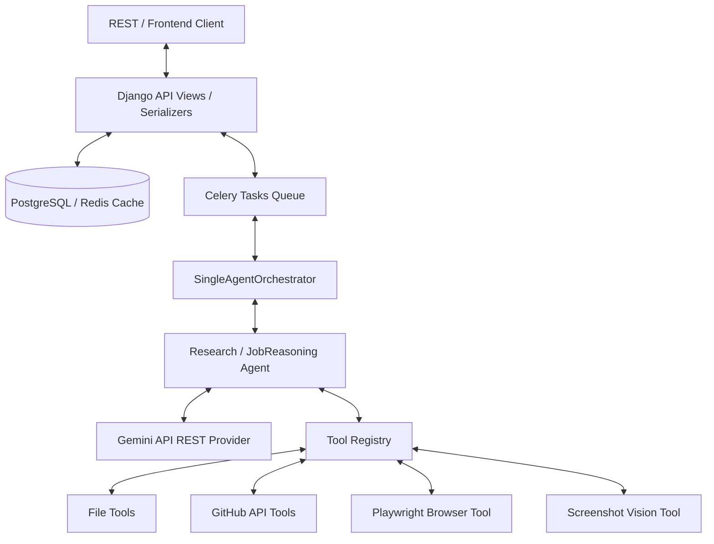

# Nomad Bot — System Architecture & Agent Capability Guide

This document serves as a high-level architectural guide for future AI agents and developers. It details **what** Nomad Bot does, **how** it operates, **what** tech stack it uses, and the **safety/production guards** that keep it secure and resource-efficient.

---

## 1. System Overview & Core Capabilities

Nomad Bot is an autonomous, background-scheduled AI agent engine designed to automate the process of job searching, resume customization, and job applications using a stateful browser and secure GitHub integrations.

### Primary Capabilities:
1. **Dynamic Job Scraper:** Navigates job boards (Greenhouse, Lever, etc.) using Playwright, scraping the text content and automatically indexing visible interactive elements (input selectors, button IDs, placeholder names, labels).
2. **Honest Resume Customizer:** Loads the user's base resume from a local file or GitHub branch, compares it against the scraped job description, identifies skill/qualification gaps, and customizes a tailored markdown resume (emphasizing relevant skills without fabricating experience).
3. **Stateless Form-Filler:** Extracts the applicant's credentials (contact details, social links, portfolio URLs) from the database and uses them to fill out online application forms.
4. **Human-in-the-Loop Safety:** Fills out forms, takes screenshots for visual review, and pauses execution, only clicking the final submit button when explicitly approved by the user.
5. **Headless Vision Loops:** Uses a multimodal vision tool to inspect captured browser screenshots, allowing the agent to debug form validation errors visually.
6. **Asynchronous Background Execution:** Runs heavy agent loops inside Celery worker nodes, preventing Django HTTP threads from blocking or timing out.
7. **Persistent Scheduling Engine:** Enables users to schedule recurring cron or interval-based job searches (e.g. "poll for new Python roles every Monday at 9am").

---

## 2. Top-Level Architecture — The Big Picture

The system follows a **Modular Monolith** structure with strict Clean Architecture boundaries:

### Core Architecture Components:
*   **The Controller Layer (`api/`):** Validates payloads using DRF Serializers, pre-creates Conversation logs to reserve UUIDs, and dispatches background tasks.
*   **The Orchestrator Layer (`orchestrator/`):** Initializes model providers and registers tools in the `ToolRegistry`. Handles database transaction commits and maps callbacks to log tool execution histories.
*   **The Agentic Core (`core/agents/`):** Houses the multi-turn ReAct reasoning loop. Decoupled from Django models (communicates purely via standard Python data types).
*   **The Infrastructure Provider (`core/llm_providers/`):** Connects to the Gemini REST API, translates messages, and extracts usage metadata.
*   **The Database & Memory Layer (`memory/`):** Persists profiles, conversation threads, execution logs, and periodic schedules in PostgreSQL.

---

## 3. The Multi-Turn Agentic Loop

The core engine is located in [research_agent.py](file:///Users/shivamsingh/personal/nomad-bot/core/agents/research_agent.py). It runs a state-of-the-art ReAct loop with safety overrides:

1.  **Stuck Loop Detection (`LoopState`):** Stores a rolling history of the last 5 tool calls. If the same tool and arguments are invoked 3+ times, it detects a stuck loop, injects an intervention prompt, and forces the model to change its reasoning approach.
2.  **Context-Window Compression:** To avoid prompt bloat, the agent compresses tool results older than 1 turn if they exceed 50 lines (retaining only the first 20 and last 10 lines, with a reference to the audit trace).
3.  **Automatic Resource Scoping:** The entire execution loop is wrapped inside a `try...finally` block. This guarantees that all active browser windows and Playwright drivers are closed immediately when the agent finishes its turn, preventing zombie processes.

---

## 4. Technology Stack & Integrations

The application is built on top of the following technologies:

| Component | Technology | Detail |
| :--- | :--- | :--- |
| **Framework** | Django / REST Framework | Clean architecture modular monolith. |
| **Database** | PostgreSQL | Handles persistence (Conversations, Messages, Runs, Tool Logs). |
| **Queue & Broker** | Celery + Redis | Handles async worker task queues. |
| **Scheduler** | django-celery-beat | Persists and runs Cron/Interval periodic tasks in the DB. |
| **Cache & Lock** | Redis Cache Backend | Atomic distributed task locks. |
| **Browser Engine** | Playwright (Python Sync) | Headless chromium form filling and page scraping. |
| **Vision Client** | Gemini REST Vision API | Analyzes screenshots using inline base64 image payloads. |
| **Repository API** | GitHub CLI (`gh`) | Handles searches, branch writes, and PR creation. |

---

## 5. Security & Safety Whitelists

To prevent hosts and repositories from being compromised by prompt injection exploits, the system implements strict safety filters:

1.  **GitHub CLI Write Protections:**
    *   Direct writes to `main`, `master`, or `production` branches are blocked.
    *   Commits modifying sensitive files (`.github/workflows/*`, environment configs `.env*`, docker configs `Dockerfile`/`docker-compose*.yml`, secrets files, or private keys `*.pem`/`*.key`) are blocked.
2.  **Browser Navigation Protections:**
    *   Navigations targeting local directory files (`file://`) are blocked.
    *   Navigations targeting loopbacks (`localhost`, `127.0.0.1`, `::1`) or cloud metadata endpoints (`169.254.169.254`) are blocked.
    *   *Optimization:* URL safety filters run *before* Playwright launches, avoiding browser instantiation overhead on blocked domains.
3.  **Distributed Task Locks:**
    *   Uses Redis caching keys (`lock:run_agent_task:{username}:{conversation}`) with `cache.add()` (atomic `SETNX`) to ensure that if beat schedules fire tasks concurrently, duplicate runs are immediately skipped.

---

## 6. The DB Memory Schema (What We Persist)

Nomad Bot records all aspects of conversation history and agent audit logs inside the database:

*   **`UserProfile`:** Name, Email, Phone, LinkedIn, GitHub, and Portfolio URLs (used as credential contexts for form-filling).
*   **`Conversation`:** Groups conversation threads together.
*   **`Message`:** Chronological message records (roles: `user`, `assistant`).
*   **`AgentRun`:** Tracks execution loop metadata:
    *   `agent_type` (which agent ran: `ResearchAgent` or `JobReasoningAgent`).
    *   `status` (`running`, `completed`, `failed`).
    *   `prompt_tokens` & `completion_tokens` (accumulated usage metrics).
    *   `total_cost` (calculated cost in USD based on model pricing).
*   **`ToolExecution`:** Complete audit trace of every tool call: input payload, execution status (`success`/`error`), and truncated stdout output.

---

## 7. Developer & Agent Cheat Sheet

### Key Code Paths:
*   [single_agent.py](file:///Users/shivamsingh/personal/nomad-bot/orchestrator/single_agent.py) — Orchestrator entry point and tool registrations.
*   [research_agent.py](file:///Users/shivamsingh/personal/nomad-bot/core/agents/research_agent.py) — ReAct loop, context compression, stuck loop checker.
*   [job_reasoning_agent.py](file:///Users/shivamsingh/personal/nomad-bot/core/agents/job_reasoning_agent.py) — Specialized job comparison and resume tailoring logic.
*   [tasks.py](file:///Users/shivamsingh/personal/nomad-bot/memory/tasks.py) — Celery shared background tasks and Redis lock controls.
*   [scheduler.py](file:///Users/shivamsingh/personal/nomad-bot/memory/scheduler.py) — DB scheduler utility helpers.
*   [browser_tool.py](file:///Users/shivamsingh/personal/nomad-bot/core/tools/implementations/browser_tool.py) — Playwright browser navigation and page scraping.
*   [vision_tool.py](file:///Users/shivamsingh/personal/nomad-bot/core/tools/implementations/vision_tool.py) — Multimodal image base64 vision analyzer.
*   [github_tool.py](file:///Users/shivamsingh/personal/nomad-bot/core/tools/implementations/github_tool.py) — Branch and commit safety-guarded GitHub tools.
*   [tests.py](file:///Users/shivamsingh/personal/nomad-bot/api/tests.py) — Complete unit test assertions.

### Execution Commands:
*   **Run Unit Tests:** `venv/bin/python manage.py test`
*   **Generate Migrations:** `venv/bin/python manage.py makemigrations`
*   **Apply Migrations:** `venv/bin/python manage.py migrate`
*   **Run Dev Server:** `venv/bin/python manage.py runserver`
*   **Start Celery Worker:** `venv/bin/celery -A config worker --loglevel=info`
*   **Start Celery Beat:** `venv/bin/celery -A config beat --loglevel=info`
