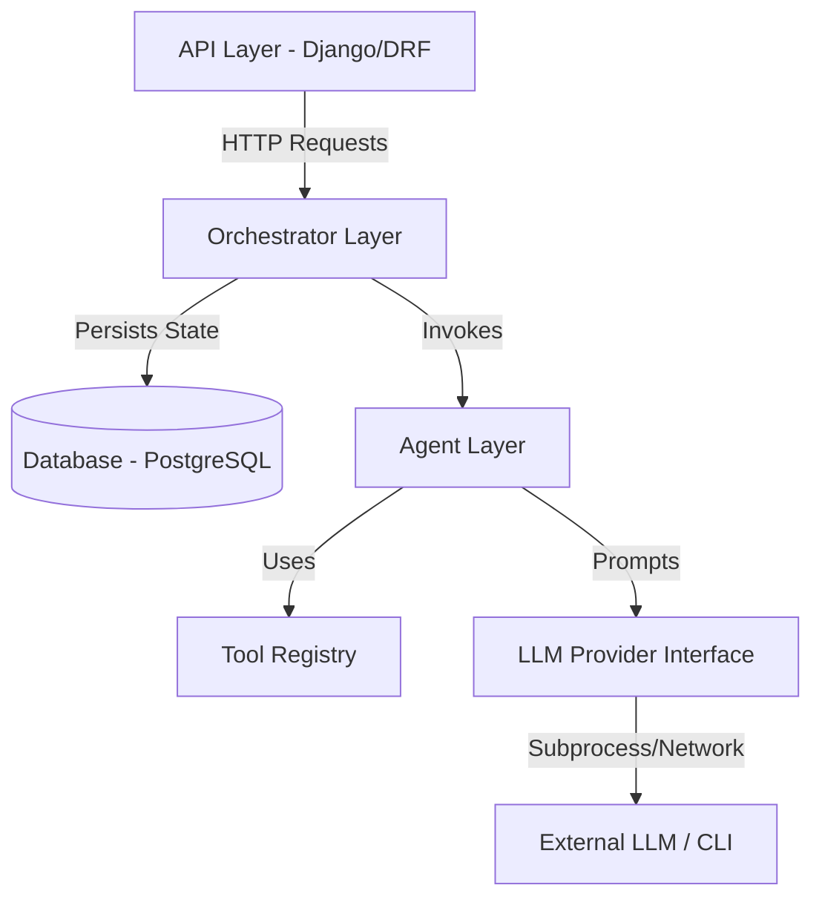

# Building a Production-Ready Personal AI Operating System: A Masterclass in System Design

*Moving past the hype: A deep dive into architecting an extensible, scalable AI application using Django, PostgreSQL, and Clean Architecture.*

If you’ve spent any time on tech Twitter, HackerNews, or GitHub recently, you’ve probably seen hundreds of "AI Agents in 50 lines of code!" tutorials. They are incredibly cool. They are magic to look at. But they all share a dirty little secret: **they are unmaintainable in production.**

When you shove API calls, database queries, string manipulation, and prompt engineering into a single file or a single route handler, you aren't building a system—you are building a ticking time bomb of technical debt. 

What happens when you need to switch from OpenAI to Anthropic because of rate limits? What happens when you need to add memory persistence? What happens when a tool execution fails and crashes your entire web server because you didn't isolate the execution environment?

In this article, we are going to walk through the architecture of a **Personal AI Operating System (AIOS)** we built from the ground up. We will break down the High-Level Design (HLD), the Low-Level Design (LLD), the specific design patterns we leveraged, and the "why" behind every single technology choice. 

Whether you are preparing for a System Design interview, migrating a toy project to production, or just want to level up your engineering skills, grab a coffee. Let's dive in.

---

## 1. The Blueprint: High-Level Design (HLD)

Before writing a single line of code, you have to decide on the shape of your application. 

### The Great Debate: Microservices vs. Modular Monolith

In modern system design, the default reflex is often, "Let's build microservices!" We resisted that urge and deliberately chose a **Modular Monolith**.

**Why?** 
Microservices introduce immense operational overhead. You are suddenly dealing with network latency, distributed tracing, complex CI/CD pipelines, and data consistency headaches across different databases. For a new system where the domain boundaries (where does the "Memory" end and the "Agent" begin?) are still evolving, a monolith is much safer. 

However, we made it strictly *modular*. 



The codebase is partitioned into folders: `core/`, `memory/`, `api/`, and `orchestrator/`. The "API" folder is physically incapable of making an AI generate text unless it goes through the Orchestrator. This gives us the clean separation of microservices with the deployment simplicity of a monolith.

### The Stack Selection: Why Django and Postgres?

Here is what we chose and, more importantly, *why*:

*   **Django & Django REST Framework (DRF):**
    *   *The "Why":* AI logic is complex enough. We didn't want to reinvent the wheel for database connections, connection pooling, migrations, and API routing. Django provides an incredible ORM out of the box. 
    *   *The "Why Not FastAPI?":* FastAPI is the darling of the AI world right now due to its speed and native async support. But for a full "Operating System" requiring robust relational data modeling (Users -> Conversations -> Agent Runs), Django's ecosystem allows us to move much faster. We traded microsecond speed for developer velocity and safety.
*   **PostgreSQL:**
    *   *The "Why":* We need absolute guarantee over our data (ACID compliance) for user profiles and chat history. Furthermore, Postgres has native `JSONB` support. When our AI executes a tool with dynamic arguments, we can store that arbitrary JSON directly in a relational table and still query it efficiently.
    *   *The "Why Not MongoDB?":* Our data is highly relational. Relational databases handle these strict relationship graphs much better than document stores.
*   **Docker Compose:**
    *   *The "Why":* Containerizing our database ensures every developer has the exact same environment. It completely eliminates the "It works on my machine" syndrome.

---

## 2. Future-Proofing the Code: Low-Level Design (LLD)

The heart of our AIOS lives in the `core/` directory. This is pure Python. It knows absolutely nothing about HTTP requests, JSON payloads, or SQL databases. This strict separation is a core tenet of **Domain-Driven Design (DDD)** and **Clean Architecture**.

To keep this core pristine, we leaned heavily on **SOLID Principles**.

### The Dependency Inversion Principle (The "D" in SOLID)

Imagine hardcoding `import google.generativeai` inside your Agent class. 

```python
# ❌ BAD: Tight Coupling
import google.generativeai as genai

class Agent:
    def run(self, prompt):
        model = genai.GenerativeModel('gemini-pro')
        return model.generate_content(prompt)
```

The moment Google changes their SDK, or the moment your engineering manager says "Let's use Claude instead," you have to rewrite your entire Agent.

**The Solution: The Strategy Pattern**

We created an abstract interface called `BaseLLMProvider`.

```python
# ✅ GOOD: Dependency Inversion
from abc import ABC, abstractmethod

class BaseLLMProvider(ABC):
    @abstractmethod
    def generate(self, prompt: str, system_prompt: str = "", tools: list = None) -> dict:
        pass
```

Our `ResearchAgent` expects *something* that implements this interface, but it doesn't care what it is. We implemented a `GeminiCLIProvider` that fulfills this contract. 

```python
class BaseAgent(ABC):
    # The agent depends on the Abstraction (BaseLLMProvider), not the concrete implementation.
    def __init__(self, provider: BaseLLMProvider, tool_registry: ToolRegistry = None):
        self.provider = provider
        self.tool_registry = tool_registry
```

This is called **Dependency Injection**. We inject the provider into the agent from the outside. If we want to switch models tomorrow, we write an `OpenAIProvider` class and pass it in. Zero changes to the agent logic.

### Dynamic Capabilities: The Registry Pattern

An AIOS needs tools (Read File, Search Web, Send Email). How do we give an agent tools without hardcoding massive, ugly `if/else` blocks?

Enter the **Registry Pattern**.

We built a `ToolRegistry` and a `BaseTool` interface. Every tool (like `FileTool`) must define a JSON Schema describing its parameters. 

```python
class FileTool(BaseTool):
    @property
    def name(self) -> str:
        return "read_file"
        
    @property
    def parameters(self) -> dict:
        return {
            "type": "object",
            "properties": {
                "file_path": {"type": "string"}
            },
            "required": ["file_path"]
        }
```

When the system boots, we "register" tools into the registry. When the agent wakes up, it asks the registry, *"What tools are available?"* The registry hands over a list of JSON schemas, which the agent passes to the LLM. 

This satisfies the **Open-Closed Principle (The "O" in SOLID)**: The system is open for extension (you can add a new tool class) but closed for modification (you never touch the agent's code).

---

## 3. The Brain: Understanding the ReAct Loop

How does an AI actually *do* things? LLMs are just text predictors; they are "brains in a jar" that cannot interact with the real world. 

To bridge this gap, we implemented a **ReAct (Reason + Act)** loop inside our `ResearchAgent`. 

Here is the flow:
1.  **Thought:** The user asks a question. The LLM receives the prompt and "thinks" about what it needs.
2.  **Action:** It realizes it needs to read a local file. Instead of returning text, it halts and outputs a structured JSON object: `{"tool_name": "read_file", "tool_args": {"file_path": "data.csv"}}`.
3.  **Observation:** Our Python code catches this JSON. It looks up `read_file` in the `ToolRegistry`, safely executes the Python function, grabs the file contents, appends it to the conversation history, and sends it *back* to the LLM.
4.  **Repeat:** The LLM evaluates the new information. If it has the answer, it returns the final text. If not, it calls another tool.

**Handling Edge Cases:**
What happens if the LLM hallucinates a tool that doesn't exist? Our code anticipates this. If `ToolRegistry.get_tool(tool_name)` throws an error, we catch it and feed the error string back to the LLM: `Tool execution failed: Error: Tool X does not exist`. The LLM reads the error and corrects itself on the next iteration. 

We hard-capped this loop at 5 iterations to prevent infinite hallucination loops, which would burn through API credits.

---

## 4. The Puppet Master: The Orchestrator

We have a pristine Agent layer and a robust Database layer. How do they talk? **They don't.** 

If your Agent is running `Conversation.objects.create()`, you have violated the Single Responsibility Principle. Your agent is now tied to Django's ORM. 

We introduced a **Mediator Pattern** via our `SingleAgentOrchestrator`. 

When an API request comes in via DRF, the View does exactly one thing: it validates the HTTP payload. Then, it passes the raw string to the Orchestrator. 

The Orchestrator acts as the puppet master:
1. It talks to the database to fetch the User's Conversation history.
2. It instantiates the `ResearchAgent` (injecting the LLM Provider and Tool Registry).
3. It tells the agent: *"Here is the prompt, here is the history. Go."*
4. It takes the agent's final response and saves it back to the database.

```python
# The Orchestrator isolates the DB from the Agent
class SingleAgentOrchestrator:
    def handle_request(self, user_profile, conversation_id, message_text: str):
        # 1. DB Logic
        conversation = Conversation.objects.get(id=conversation_id)
        history = list(conversation.messages.all())
        
        # 2. Agent Logic
        response_text = self.agent.execute(prompt=message_text, conversation_history=history)
        
        # 3. DB Logic
        Message.objects.create(conversation=conversation, role='assistant', content=response_text)
        
        return response_text
```

This keeps the business logic completely decoupled from the data persistence layer. You could rip out Django tomorrow and replace it with Flask and SQLAlchemy, and the Orchestrator, Agent, and Tools would remain entirely untouched.

---

## Conclusion: The Takeaways for System Design

Building a toy AI app takes 10 minutes. Building an AI system that won't collapse under its own weight takes discipline. 

If you take anything away from this architecture, let it be this:
*   **Abstractions are your best friend:** Don't marry your codebase to a single LLM provider. Build interfaces.
*   **Keep your domains clean:** AI logic should not know about HTTP requests or SQL. Use an Orchestrator.
*   **Design for observability:** We save every `AgentRun` and `ToolExecution` in our database. When an AI inevitably hallucinates or fails, you need a deterministic audit trail to understand *why*.

By strictly adhering to these principles, our AIOS is now highly extensible, rigorously testable, and ready to scale to handle complex, multi-agent workflows in the future. 

Happy coding!
