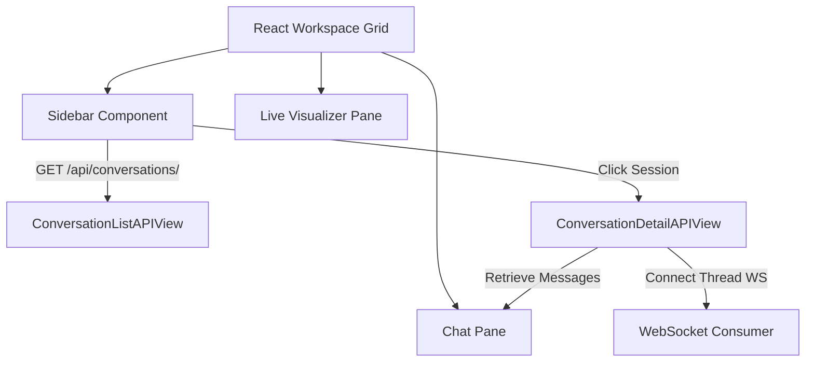

# Conversation History & Sidebar Panel

We have integrated a professional sidebar panel in the frontend workspace and backed it with dedicated database endpoints in Django to manage, list, retrieve, and transition between user conversation threads.

---

## 1. Architecture Overview



---

## 2. Backend API Design

We added two new views in [views.py](file:///Users/shivamsingh/personal/nomad-bot/api/views.py) and registered them in [urls.py](file:///Users/shivamsingh/personal/nomad-bot/api/urls.py):

### A. Conversation List Endpoint
*   **Path:** `/api/conversations/`
*   **Method:** `GET`
*   **Response Model:**
    ```json
    [
      {
        "id": "e4b47a1c-3c87-43c2-a279-d2d7c8651a2d",
        "title": "Search for jobs matching Title: \"Python Developer\"...",
        "created_at": "2026-07-16T19:40:00Z",
        "updated_at": "2026-07-16T19:40:05Z"
      }
    ]
    ```

### B. Conversation Detail Endpoint
*   **Path:** `/api/conversations/<uuid:conversation_id>/`
*   **Method:** `GET`
*   **Response Model:**
    ```json
    {
      "id": "e4b47a1c-3c87-43c2-a279-d2d7c8651a2d",
      "title": "Search for jobs matching Title: \"Python Developer\"...",
      "messages": [
        {
          "id": "a0f2b23a-1234-5678-abcd-ef0123456789",
          "role": "user",
          "content": "First query text",
          "created_at": "2026-07-16T19:40:00Z"
        },
        {
          "id": "b1f2b23b-5678-1234-abcd-ef0123456789",
          "role": "assistant",
          "content": "First agent response",
          "created_at": "2026-07-16T19:40:05Z"
        }
      ]
    }
    ```

### C. Conversation Title Generation
Upon submitting the first user query in both sync and async execution orchestrators, the system parses the text and auto-generates a title (trimmed to the first 50 characters followed by an ellipsis if needed). This title is saved in the database record:
```python
if not conversation.title and message_text:
    conversation.title = message_text[:50] + ("..." if len(message_text) > 50 else "")
    conversation.save(update_fields=['title'])
```

---

## 3. Frontend Implementation Details

### A. Sidebar Panel
A third panel is inserted on the far left of the main workspace grid (`.workspace-grid` template columns modified from `1.15fr 1.35fr` to `260px 1.1fr 1.3fr`).
*   **New Chat Button:** Clears all active state variables, closes any active WebSocket connections, and resets the chat history to the welcome state.
*   **Scrollable List:** Dynamically retrieves and lists all conversations stored in the database. Active items highlight in a medium gray background (`#cbd5e1`).

### B. Bug Fixes
*   **Agent Type Routing:** Resolved a key bug where `agent_type` was omitted from the post request payload. It is now correctly passed to execute target routing rules (e.g. `JobReasoningAgent` or `ResearchAgent`).
*   **Safe Message Parsing:** Hardened `formatContent` to handle undefined message content gracefully.
