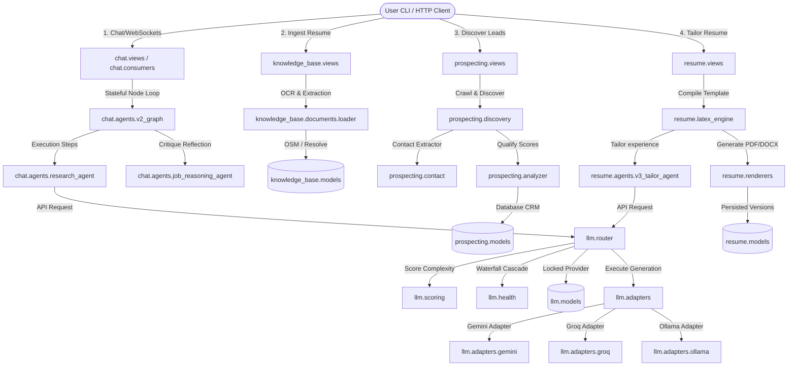

# Nomad Bot V3.5 Core System Architecture Map

This document outlines the modular directory structure, module functionalities, database schemas, and end-to-end request lifecycles of the **Nomad Bot V3.5** backend system.

---

## 1. High-Level Architectural Flow Chart

This diagram illustrates how data flows from ingestion/user queries through the agentic nodes, resolving via LLM adapters, database locks, and document builders:

---

## 2. Directory Structure & Module Breakdown

### `llm/` (The Core Model Integration Layer)
Provides the central orchestration interface with LLM providers, including fallback routing, cost audits, and parameter overrides:

*   [interfaces.py](file:///Users/shivamsingh/personal/nomad-bot/llm/interfaces.py): Base protocol class (`BaseLLMAdapter`) that every provider adapter must implement.
*   [base.py](file:///Users/shivamsingh/personal/nomad-bot/llm/base.py): Base config settings for the LLM providers.
*   [router.py](file:///Users/shivamsingh/personal/nomad-bot/llm/router.py): **Central routing dispatcher (`IntelligentRouter`)**. Calculates complexity score, checks health logs, cascades through fallback priority lists (`ROUTER_FALLBACK_SIMPLE`, etc.), and locks successful choices to DB.
*   [health.py](file:///Users/shivamsingh/personal/nomad-bot/llm/health.py): Manages provider health monitoring, logging failures, and handling cool-down blacklists.
*   [scoring.py](file:///Users/shivamsingh/personal/nomad-bot/llm/scoring.py): Calculates the complexity score of a prompt + tools to route it to the appropriate tier list.
*   [registry.py](file:///Users/shivamsingh/personal/nomad-bot/llm/registry.py): Dynamic loader mapping provider keys to their respective adapters.
*   [adapters/](file:///Users/shivamsingh/personal/nomad-bot/llm/adapters/): Implementation files for specific API adapters:
    *   [gemini.py](file:///Users/shivamsingh/personal/nomad-bot/llm/adapters/gemini.py): Gemini API implementation.
    *   [groq.py](file:///Users/shivamsingh/personal/nomad-bot/llm/adapters/groq.py): High-performance Llama3 adapter.
    *   [ollama.py](file:///Users/shivamsingh/personal/nomad-bot/llm/adapters/ollama.py): Local fallback developer adapter.
    *   [cerebras.py](file:///Users/shivamsingh/personal/nomad-bot/llm/adapters/cerebras.py) / [openrouter.py](file:///Users/shivamsingh/personal/nomad-bot/llm/adapters/openrouter.py): Secondary fallback integrations.
*   [tools/](file:///Users/shivamsingh/personal/nomad-bot/llm/tools/): Declarations and code execution wrappers for tools exposed to agents:
    *   [base.py](file:///Users/shivamsingh/personal/nomad-bot/llm/tools/base.py): Base class for registering custom agent tools.
    *   [registry.py](file:///Users/shivamsingh/personal/nomad-bot/llm/tools/registry.py): Registers and resolves tool schemas.
    *   [implementations/file_tool.py](file:///Users/shivamsingh/personal/nomad-bot/llm/tools/implementations/file_tool.py): Read/write file tools.
    *   [implementations/browser_tool.py](file:///Users/shivamsingh/personal/nomad-bot/llm/tools/implementations/browser_tool.py): Playwright scraper integration.
*   [models.py](file:///Users/shivamsingh/personal/nomad-bot/llm/models.py): Defines the `AgentConfig` model (prompt instructions and configuration) and the `PromptRun` model (audits tokens, costs, and execution times).

---

### `knowledge_base/` (Raw Ingestion Pipeline)
Acts as the central repository for the user's raw experience profile:

*   [models.py](file:///Users/shivamsingh/personal/nomad-bot/knowledge_base/models.py): Stores user info, job logs, parsed items (`UserProfile`, `Experience`, `Project`, `Skill`).
*   [ingestion.py](file:///Users/shivamsingh/personal/nomad-bot/knowledge_base/ingestion.py): Orchestrator matching files/texts, parsing fields, and saving them.
*   [documents/loader.py](file:///Users/shivamsingh/personal/nomad-bot/knowledge_base/documents/loader.py): Document parsing library.
*   [documents/ocr.py](file:///Users/shivamsingh/personal/nomad-bot/knowledge_base/documents/ocr.py): Fallback Tesseract OCR scan for image-only PDFs.
*   [documents/detector.py](file:///Users/shivamsingh/personal/nomad-bot/knowledge_base/documents/detector.py): Evaluates whether a file requires OCR conversion.
*   [jobs/parser.py](file:///Users/shivamsingh/personal/nomad-bot/knowledge_base/jobs/parser.py): Parses raw text fields to extract structured JSON data.
*   [jobs/ats_analyzer.py](file:///Users/shivamsingh/personal/nomad-bot/knowledge_base/jobs/ats_analyzer.py): Scores user suitability and highlights missing keywords.

---

### `chat/` (Agent Loop Orchestrator)
Orchestrates agentic tasks via state graphs and hosts consumer endpoints:

*   [consumers.py](file:///Users/shivamsingh/personal/nomad-bot/chat/consumers.py): ASGI WebSocket consumer streaming real-time logs, plan visualization updates, human approval prompts, and assistant response tokens.
*   [models.py](file:///Users/shivamsingh/personal/nomad-bot/chat/models.py): Persists state checkpoints (`Conversation`, `Message`, `AgentCheckpoint`, `AgentMemory`).
*   [agents/v2_graph.py](file:///Users/shivamsingh/personal/nomad-bot/chat/agents/v2_graph.py): **Stateful LangGraph runtime**. Configures steps (plan, execute, critique, human-gate) and manages the retry loops.
*   [agents/research_agent.py](file:///Users/shivamsingh/personal/nomad-bot/chat/agents/research_agent.py): Research agent implementation. Manages tool execution loops, context compression, and `LoopState` stuck warnings.
*   [agents/job_reasoning_agent.py](file:///Users/shivamsingh/personal/nomad-bot/chat/agents/job_reasoning_agent.py): Critic agent analyzing plans.
*   [scheduler.py](file:///Users/shivamsingh/personal/nomad-bot/chat/scheduler.py) / [tasks.py](file:///Users/shivamsingh/personal/nomad-bot/chat/tasks.py): Runs long background tasks asynchronously via Celery worker queues.

---

### `resume/` (Resume Tailoring Engine)
Takes structured profile data and target requirements to generate optimized documents:

*   [latex_engine.py](file:///Users/shivamsingh/personal/nomad-bot/resume/latex_engine.py): Manages compilation of Jinja2 LaTeX files to PDF or HTML.
*   [templates.py](file:///Users/shivamsingh/personal/nomad-bot/resume/templates.py): Declares available layouts.
*   [spec.py](file:///Users/shivamsingh/personal/nomad-bot/resume/spec.py): Data structure definitions.
*   [models.py](file:///Users/shivamsingh/personal/nomad-bot/resume/models.py): Persists templates and versions (`ResumeTemplate`, `ResumeVersion`).
*   [agents/v3_tailor_agent.py](file:///Users/shivamsingh/personal/nomad-bot/resume/agents/v3_tailor_agent.py): Agent that processes achievements and dynamically updates bullet points to align with job targets.
*   [pipelines/optimization_pipeline.py](file:///Users/shivamsingh/personal/nomad-bot/resume/pipelines/optimization_pipeline.py): Pipeline coordinating parser results, tailoring agents, LaTeX compilation, and version logs.

---

### `prospecting/` (Lead Suitability Engine)
Crawls and qualifies target businesses to populate the CRM database:

*   [discovery.py](file:///Users/shivamsingh/personal/nomad-bot/prospecting/discovery.py): Business Discovery Engine querying OSM directory or DuckDuckGo searches to gather company details and websites.
*   [contact.py](file:///Users/shivamsingh/personal/nomad-bot/prospecting/contact.py): Crawls homepage footers to extract emails and LinkedIn URLs.
*   [analyzer.py](file:///Users/shivamsingh/personal/nomad-bot/prospecting/analyzer.py): LLM scraper analyzing company business models and assigning suitability scores.
*   [models.py](file:///Users/shivamsingh/personal/nomad-bot/prospecting/models.py): Stores discovery session logs, qualified leads, contacts, and suitability checks (`DiscoveryRun`, `LeadCompany`, `LeadContact`, `WebsiteAnalysis`).

---

## 3. Technology Choices & Alternatives

| Term / Component | Purpose | Nomad Bot Choice | Alternatives Considered | Rationale |
| :--- | :--- | :--- | :--- | :--- |
| **Model Router** | Cascade to failover providers | Custom Python Waterfall | LiteLLM | Custom code allows lightweight database model locking and custom health cool-down limits with zero third-party dependencies. |
| **State Loop** | Multi-node agent coordination | LangGraph (Python) | AutoGen / CrewAI | LangGraph provides deterministic flow control (perfect for human-in-the-loop gates) compared to pure agent conversations. |
| **Ingestion OCR** | Parse image-only resume files | Tesseract OCR | Google Document AI | Tesseract is open-source, local, and free, preventing API cost leaks for simple image extractions. |
| **Document Engine** | Build resume downloads | LaTeX | WeasyPrint (HTML-to-PDF) | LaTeX guarantees professional, single-page page-budget formatting and typesetting. |
